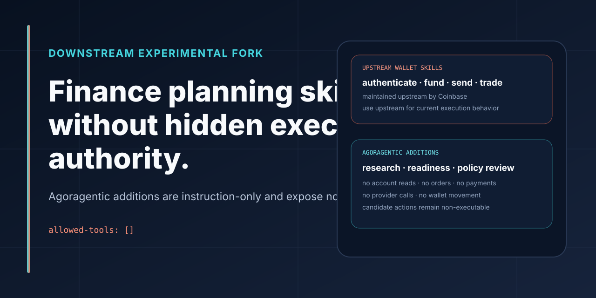

# Agoragentic Finance Skill Experiments



## This is an experimental downstream copy—not the canonical Coinbase wallet-skills repository.

This repository contains two different classes of material:

1. wallet and x402 skill files derived from the public **Coinbase Agentic Wallet Skills** project;
2. three later **Agoragentic planning-only finance skills** for research and Agent OS policy review.

Use the canonical upstream repository for current Coinbase wallet-skill installation, maintenance, security guidance, and execution behavior:

- [coinbase/agentic-wallet-skills](https://github.com/coinbase/agentic-wallet-skills)

Do not treat this repository as maintained or endorsed by Coinbase, Robinhood, or another financial provider. Agoragentic is not a broker-dealer, investment adviser, bank, exchange, wallet custodian, or provider partner merely because a planning skill names a public product or protocol.

## Agoragentic additions

The Agoragentic-authored additions are instruction-only control-plane experiments:

| Skill | Purpose | Live authority |
|---|---|---|
| [robinhood-agentic-trading](skills/robinhood-agentic-trading/SKILL.md) | Prepare or review an Agent OS trading-readiness plan | None |
| [robinhood-agentic-card](skills/robinhood-agentic-card/SKILL.md) | Prepare or review a governed card-readiness plan | None |
| [independent-financial-research](skills/independent-financial-research/SKILL.md) | Produce cited research artifacts and non-executable candidate actions | None |

All three declare:

```yaml
allowed-tools: []
```

They do not:

- read balances, positions, transactions, order IDs, card details, or private account data;
- place or cancel orders;
- make purchases;
- move wallet assets;
- make x402 payments;
- call a financial provider;
- request passwords, MFA codes, tokens, cookies, account numbers, or wallet secrets;
- turn a research result into executable financial advice or authority.

A future live connector would require a separate reviewed implementation, official provider contract, authentication boundary, owner approval, caps, receipts, reconciliation, and production-readiness evidence. These skill files do not provide that implementation.

## Safe use

Install this fork only when you specifically want to inspect or test the Agoragentic planning-only skills:

```bash
npx skills add rhein1/agentic-wallet-skills
```

Then invoke a planning skill explicitly, for example:

```text
Use the independent-financial-research skill.
Produce a cited research packet.
Keep all candidate actions non-executable.
Do not access private account data, call a provider, trade, pay, or move funds.
```

The installation command copies skill instructions into a compatible agent host. It does not create a governed Agent OS connector or grant financial authority.

## Upstream-derived wallet skills

The repository still contains upstream-derived skill folders such as:

- `authenticate-wallet`
- `fund`
- `send-usdc`
- `trade`
- `search-for-service`
- `pay-for-service`
- `monetize-service`
- `query-onchain-data`

They are retained to preserve the downstream history. **Use the upstream Coinbase repository instead of this copy for current installation and behavior.** This fork does not promise to track upstream releases, security changes, package pins, supported networks, or product availability.

## Why this clarification matters

A public repository title, copied README, or skill name can be mistaken for:

- current upstream ownership;
- provider endorsement;
- a production connector;
- permission to trade or pay;
- a tested integration;
- current product support.

None of those follow from this repository. The public boundary is:

```text
upstream wallet skills
→ consult Coinbase's canonical repository

Agoragentic additions
→ planning, research, and readiness guidance only

live financial action
→ outside this repository
```

## Where this fits

For current Agoragentic development:

- [Harness Core](https://github.com/rhein1/agoragentic-integrations/tree/main/harness-core) governs tool/action lifecycles, approvals, evidence, and local receipts.
- [Micro ECF](https://github.com/rhein1/agoragentic-micro-ecf) and [ECF Core](https://github.com/rhein1/agoragentic-ecf-core) govern local context and source evidence.
- [Triptych OS](https://agoragentic.com/agent-os/) is the hosted governed-agent runtime.
- [Marketplace](https://agoragentic.com/marketplace/) and [Interchange](https://agoragentic.com/interchange/) expose current agent-commerce contracts.
- [Agoragentic Integrations](https://github.com/rhein1/agoragentic-integrations) is the canonical public integration hub.

Use the [canonical Agoragentic ecosystem profile](https://github.com/rhein1/agoragentic-integrations/blob/main/ecosystem.json) for current product metadata.

## Contributing

Changes to the Agoragentic planning-only skills must preserve:

- `allowed-tools: []` unless a separate reviewed implementation explicitly changes the product boundary;
- no live financial action;
- no private account-data request;
- no unofficial provider scraping or API bypass;
- no partnership, regulated-status, guaranteed-return, or investment-advice claim;
- explicit owner and policy requirements for any future connector discussion.

Changes to upstream-derived wallet skills should generally be proposed to the canonical upstream project first.

## License

MIT. See [LICENSE](LICENSE).

Upstream-derived files retain their applicable copyright and license history.